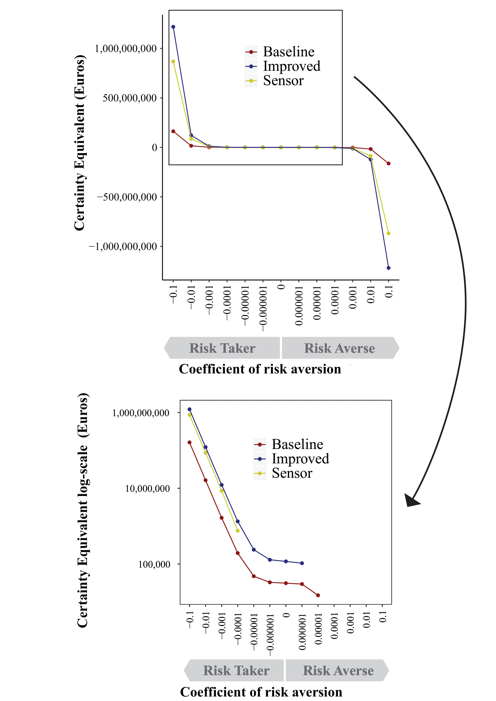
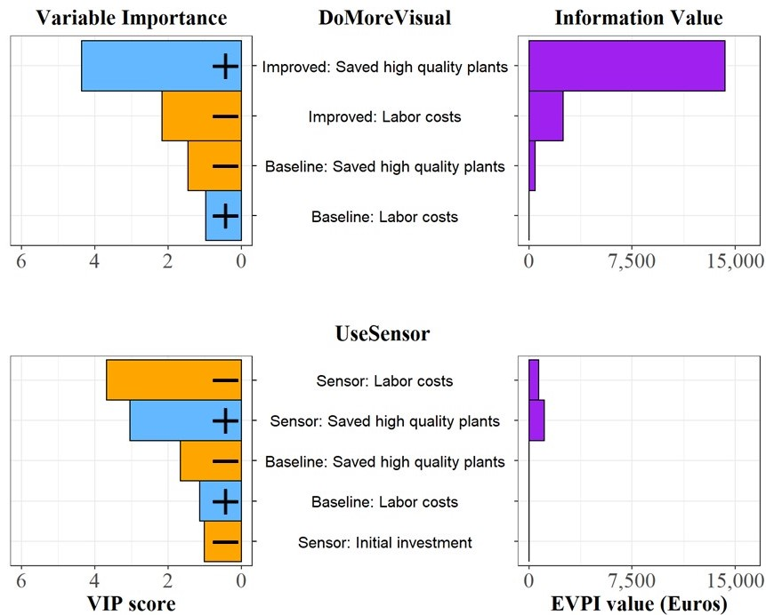

```{r setup, include=FALSE}

knitr::opts_chunk$set(echo = TRUE)

library(decisionSupport)
library(dplyr)
library(extrafont)
library(magrittr)
library(ggplot2)
library(ggpubr)
library(ggstance)
library(tidyverse)
library(devtools)
library(knitr)
library(kableExtra)
library(bookdown)

options(knitr.table.format = "html")

```

This supplementary is available under https://github.com/marruett/Supplementary_Ruett_Precision_Agriculture and outlines the Decision Analysis approaches used in `Assessing expected utility and profitability to support decision-making for disease control strategies in ornamental heather production` Ruett et al. (under review in Precision Agriculture). Here the code is provided to allow for transparent reproduction of the model. To create and organize this supplementary file the packages `devtools` [@wickhamDevtoolsToolsMake2019], `knitr` [@xieKnitrGeneralPurposePackage2019], `kableExtra` [@zhuKableExtraConstructComplex2019] and `bookdown` [@xieBookdownAuthoringBooks2019] are used. All other applied `R` packages are cited and listed in the [References].

## Input table for assessment of expected utility and profitability to support decision-making in ornamental heather production

The input table `Input_CBA.csv` (attached) contains: Variable names, unit, distributions (posnorm = positive normal distribution, const = constant, tnorm_0_1= truncated normal distribution), lower bound, mean, upper bound and definition of all the input variables for the model. The abbreviation `CBA` refers to `Cost Benefit Assessment`. 

## Implementing the model in R

Here the mathematical model that enables simulation of decision outcomes is provided. The calculations in this document are based on random draws from the distributions in the input table `Input_CBA.csv`. Explanations for code chunks are not part of the actual simulation. The following code descriptions guide readers through the process of code development.

A function called `Simulation` is generated to evaluate the decision options in `decisionSupport` [@luedelingDecisionSupportQuantitativeSupport2021]. Within this function the `Cost_Benefit` function represents the code to compute the costs and benefits for a monitoring strategy over a particular time period. The cashflow and the Net Present Value (NPV) are calculated for the three monitoring strategies by wrapping the Simulation function around the `Cost_Benefit` function. The following calculations show how the functions are coded (see the entire function below).

```

Simulation <- function(){
  Cost_Benefit <- function(n_years, # number of years to run the simulation
                            highrisk_year, # Years with a high risk of fungal infections
                            CV, # coefficient indicating variation into a time series
                            area, # area of the heather production system
                            sample_costs, # costs per lab sample
                            value_of_discarded_plant, # value of a sampled and then 
                            # discarded heather plant
                            plant_value_of_A1_quality, # plant value of marketable heather
                            # plant that would not have achieved high quality without 
                            # the respective monitoring strategy.
                            Initial_investment, # Mandatory investment in the first year
                            # to start then respective monitoring approach
                            additional_investment, # Occurring investments is the following
                            # years 
                            labor_costs, # Labor costs to conduct monitoring
                            post_processing_costs, # Data processing of acquired data
                            sample_number, # Number of lab samples
                            additional_saved_plants, # number of heather plants that would
                            # not have achieved high marketable quality without the
                            # respective monitoring strategy.
                            adjustment_sample_size, # Adjustment to increase sample size 
                            # in high risk years 
                            increased_resource_use_costs, # Costs for increased resource
                            # use to protect heather plants in high risk years
                            resource_savings # Monetary savings for reduced resource
                            # use in normal risk years due to the respective monitoring
                            # strategy
  ){

```

First the labor costs per area are defined. Note that the `vv` function from the `decisionSupport` [@luedelingDecisionSupportQuantitativeSupport2021] is applied to introduce variability into the time series. This function produces a series of n values drawn from a normal distribution, with a mean corresponding to the specified input value (here labor_costs) and a coefficient of variation corresponding to the value of CV.

```

  yearly_labor_costs_per_ha <- vv(labor_costs, CV, n = n_years)

```

Then the number of samples per hectare are defined.

```

  samples_per_ha <- round(vv(sample_number, CV, n = n_years) *
      (1+highrisk_year * (vv(adjustment_sample_size, CV, n = n_years))), digits = 0)

```

The sample costs per hectare are defined and the value of discarded plants per hectare is defined for each year.

```

    sample_costs_per_ha <- samples_per_ha * sample_costs
    
    discarded_plant_value_per_ha <- samples_per_ha *
      vv(value_of_discarded_plant, CV, n = n_years)
    
```    

The total labor and sample costs are defined for the whole production system.

```

    labor_and_sample_cost <- (yearly_labor_costs_per_ha +
                                    sample_costs_per_ha +
                                    discarded_plant_value_per_ha) * area

```

The initial investment of the first year and additional investments (maintenance costs) of the following years are defined. Then the labor and sample costs, the data post processing-costs, the initial investment and the additional investments are summed up. The result is defined as the total costs.

```

    total_cost <- labor_and_sample_cost +
      vv(post_processing_costs, CV, n = n_years) + 
      c(Initial_investment, rep(0,n_years-1)) +
      c(0,vv(additional_investment, CV, n = n_years-1))

```

Benefits of monitoring strategies consist of resource savings that are achieved in normal-risk years and the value of saved plants in high-risk years.
In normal-risk years the number of fungicide applications can be reduced to some extent, because more monitoring increases knowledge about plant health status in the field. Therefore, resource savings can be achieved in these years.
Although monitoring allows for resource savings in normal-risk years, no resource savings are achieved in high-risk years because a higher number of pesticide applications is required. However, thanks to more precise knowledge about the spatial distribution of plant vitality producers are able to protect the quality of more plants, which are safely cultivated until they are sold.


The resource savings in normal-risk years and the value of saved high-quality plants in high-risk years are defined. These monetary values are summed up and the result is defined as the total benefits.

```

    resource_savings <- vv(resource_savings, CV, n = n_years) * area * (1-highrisk_year)
    
    value_of_high_quality_plants <- vv(additional_saved_plants, CV, n = n_years) * 
                                       plant_value_of_A1_quality * area * highrisk_year
    
    total_benefits <- resource_savings + value_of_high_quality_plants

```

In the return command the output of the `Cost_Benefit` function is defined as cashflow.

```

 return(cashflow = total_benefits - total_cost)}

```

High-risk years can increase sample size and resource use. Occurrence of high-risk years is defined using the chance_event function from `decisionSupport` [@luedelingDecisionSupportQuantitativeSupport2021]. The chance of a high-risk year occurring (chance_high_risk) is defined in the input table as a probability of 40% to 60%, reflecting the probability of risky weather.

```

  highrisk_year <- chance_event(chance_high_risk, n = n_years)

```

The `Cost_Benefit` function is simulated for standard monitoring (Baseline) and the result is defined as 'cashflow_B'.

```

   cashflow_B <- Cost_Benefit(n_years = n_years,
                              highrisk_year = highrisk_year,
                              CV = var_CV,
                              area = production_area,
                              sample_costs = lab_costs_per_sample,
                              value_of_discarded_plant = plant_value_of_discarded_plant,
                              plant_value_of_A1_quality = plant_value_of_A1_quality,
                              Initial_investment = Initial_investment_B , 
                              additional_investment = additional_investment_B ,
                              labor_costs = labor_costs_B,
                              post_processing_costs = post_processing_costs_B,
                              sample_number = sample_number_B,
                              additional_saved_plants = Number_of_saved_high_quality_plants_B,
                              adjustment_sample_size = adjustment_sample_size_B,
                              resource_savings = resource_savings_B)

```

The Net Present Value is calculated for 'Baseline' monitoring.

```

  NPV_B <- discount(cashflow_B, discount_rate, calculate_NPV = TRUE)

```

The `Cost_Benefit` function is run for more intense monitoring (Improved) and the result is defined as 'cashflow_I'.

```

  cashflow_I <- Cost_Benefit(n_years = n_years,
                              highrisk_year = highrisk_year,
                              CV = var_CV,
                              area = production_area,
                              sample_costs = lab_costs_per_sample,
                              value_of_discarded_plant = plant_value_of_discarded_plant,
                              plant_value_of_A1_quality = plant_value_of_A1_quality,
                              Initial_investment = Initial_investment_I , 
                              additional_investment = additional_investment_I ,
                              labor_costs = labor_costs_I,
                              post_processing_costs = post_processing_costs_I,
                              sample_number = sample_number_I,
                              additional_saved_plants = Number_of_saved_high_quality_plants_I,
                              adjustment_sample_size = adjustment_sample_size_I,
                              resource_savings = resource_savings_I)

```

The Net Present Value is calculated for 'Improved' monitoring.
 
```

NPV_I <- discount(cashflow_I, discount_rate, calculate_NPV = TRUE)

```

Here we calculated the Net Present Value for the decision to apply 'Improved' instead of 'Baseline' monitoring.

```

  comp_NPV_IB <- NPV_I - NPV_B

```

The Cost_Benefit function is run for monitoring with sensor technology (Sensor) and the result is defined as 'cashflow_S'.

```

  cashflow_S  <- Cost_Benefit(n_years = n_years,
                              highrisk_year = highrisk_year,
                              CV = var_CV,
                              area = production_area,
                              sample_costs = lab_costs_per_sample,
                              value_of_discarded_plant = plant_value_of_discarded_plant,
                              plant_value_of_A1_quality = plant_value_of_A1_quality,
                              Initial_investment = Initial_investment_S , 
                              additional_investment = additional_investment_S ,
                              labor_costs = labor_costs_S,
                              post_processing_costs = post_processing_costs_S,
                              sample_number = sample_number_S,
                              additional_saved_plants = Number_of_saved_high_quality_plants_S,
                              adjustment_sample_size = adjustment_sample_size_S,
                              resource_savings = resource_savings_S)

```

The Net Present Value is calculated for 'Sensor' monitoring.

```

NPV_S <- discount(cashflow_S, discount_rate, calculate_NPV = TRUE)

```

The Net Present Value is calculated for the decision to apply 'Sensor' instead of 'Baseline' monitoring.

```

  comp_NPV_SB <- NPV_S - NPV_B

```

At the end of the `Simulation` function all calculated outcomes are listed.

```

  return(list(cashflow_B = cashflow_B,
              NPV_B = NPV_B,
              cashflow_I = cashflow_I,
              NPV_I = NPV_I, 
              cashflow_S = cashflow_S,
              NPV_S = NPV_S,
              comp_NPV_IB = comp_NPV_IB,
              comp_NPV_SB = comp_NPV_SB))
}

```

The legend file, Monte Carlo results folder, and EVPI results folder are defined.

```

legend_file <- "Legend_CBA.csv"
MC_Results_folder <- "MC_Results_CBA"
EVPI_Results_folder <- "EVPI_Results_CBA"

```

The `decisionSupport` function facilitated to run the Monte Carlo simulation.

```

decisionSupport(inputFilePath = input_table,
                outputPath = MC_Results_folder, 
                welfareFunction = Simulation, 
                write_table = TRUE,
                numberOfModelRuns = 10000, 
                functionSyntax = "plainNames")

```

All outcome variables are produced with the `decisionSupport` function. The Monte Carlo Simulation results are stored in the MC_file and generate the EVPI files.

```

MC_file <- read.csv(paste(MC_Results_folder,"/mcSimulationResults.csv",sep = ""))

MC_file_without_cashflow <- select(MC_file, -c(1, starts_with("cashflow")))
multi_EVPI(mc = MC_file_without_cashflow,first_out_var = "NPV_B",
           write_table = TRUE,outfolder = EVPI_Results_folder)

welfare_summary <- read.csv(paste(MC_Results_folder,"/welfareDecisionSummary.csv",sep = ""))

```

# R function: Simulation

Here the code is shown in one piece for an overview of all calculations.

```

library(decisionSupport)

input_table <- "Input_CBA.csv"
legend_file <- "Legend_CBA.csv"
MC_Results_folder <- "MC_Results_CBA"
EVPI_Results_folder <- "EVPI_Results_CBA"

make_variables <- function(est,n = 1)
{ x <- random(rho = est, n = n)
for(i in colnames(x)) assign(i, as.numeric(x[1,i]),envir = .GlobalEnv)}
make_variables(estimate_read_csv(input_table))
dir.create(MC_Results_folder)

Simulation <- function(){

  Cost_Benefit <- function(n_years,
                            highrisk_year, 
                            CV, 
                            area, 
                            sample_costs, 
                            value_of_discarded_plant, 
                            plant_value_of_A1_quality, 
                            Initial_investment,
                            additional_investment,
                            labor_costs, 
                            post_processing_costs, 
                            sample_number, 
                            additional_saved_plants,  
                            adjustment_sample_size, 
                            increased_resource_use_costs,
                            resource_savings){ 

    yearly_labor_costs_per_ha <- vv(labor_costs, CV, n = n_years)
    
    samples_per_ha <- round(vv(sample_number, CV, n = n_years) *
      (1+highrisk_year * (vv(adjustment_sample_size, CV, n = n_years))), digits = 0)
    
    sample_costs_per_ha <- samples_per_ha * sample_costs
    
    discarded_plant_value_per_ha <- samples_per_ha *
      vv(value_of_discarded_plant, CV, n = n_years)
    
    labor_and_sample_cost <- (yearly_labor_costs_per_ha +
                                    sample_costs_per_ha +
                                    discarded_plant_value_per_ha) * area

    total_cost <- labor_and_sample_cost +
      vv(post_processing_costs, CV, n = n_years) + 
      c(Initial_investment, rep(0,n_years-1)) +
      c(0,vv(additional_investment, CV, n = n_years-1))
    
    resource_savings <- vv(resource_savings, CV, n = n_years) * area * (1-highrisk_year)
    
    value_of_high_quality_plants <- vv(additional_saved_plants, CV, n = n_years) * 
                                       plant_value_of_A1_quality * area * highrisk_year
    
    total_benefits <- resource_savings + value_of_high_quality_plants
    
    return(cashflow = total_benefits - total_cost)}
  
  highrisk_year <- chance_event(chance_high_risk, n = n_years)
  
  cashflow_B <- Cost_Benefit(n_years = n_years,
                              highrisk_year = highrisk_year,
                              CV = var_CV,
                              area = production_area,
                              sample_costs = lab_costs_per_sample,
                              value_of_discarded_plant = plant_value_of_discarded_plant,
                              plant_value_of_A1_quality = plant_value_of_A1_quality,
                              Initial_investment = Initial_investment_B , 
                              additional_investment = additional_investment_B ,
                              labor_costs = labor_costs_B,
                              post_processing_costs = post_processing_costs_B,
                              sample_number = sample_number_B,
                              additional_saved_plants = Number_of_saved_high_quality_plants_B,
                              adjustment_sample_size = adjustment_sample_size_B,
                              resource_savings = resource_savings_B)
  
  NPV_B <- discount(cashflow_B, discount_rate, calculate_NPV = TRUE)
  
  cashflow_I <- Cost_Benefit(n_years = n_years,
                              highrisk_year = highrisk_year,
                              CV = var_CV,
                              area = production_area,
                              sample_costs = lab_costs_per_sample,
                              value_of_discarded_plant = plant_value_of_discarded_plant,
                              plant_value_of_A1_quality = plant_value_of_A1_quality,
                              Initial_investment = Initial_investment_I , 
                              additional_investment = additional_investment_I ,
                              labor_costs = labor_costs_I,
                              post_processing_costs = post_processing_costs_I,
                              sample_number = sample_number_I,
                              additional_saved_plants = Number_of_saved_high_quality_plants_I,
                              adjustment_sample_size = adjustment_sample_size_I,
                              resource_savings = resource_savings_I)

  NPV_I <- discount(cashflow_I, discount_rate, calculate_NPV = TRUE)

  comp_NPV_IB <- NPV_I - NPV_B

  cashflow_S  <- Cost_Benefit(n_years = n_years,
                              highrisk_year = highrisk_year,
                              CV = var_CV,
                              area = production_area,
                              sample_costs = lab_costs_per_sample,
                              value_of_discarded_plant = plant_value_of_discarded_plant,
                              plant_value_of_A1_quality = plant_value_of_A1_quality,
                              Initial_investment = Initial_investment_S , 
                              additional_investment = additional_investment_S ,
                              labor_costs = labor_costs_S,
                              post_processing_costs = post_processing_costs_S,
                              sample_number = sample_number_S,
                              additional_saved_plants = Number_of_saved_high_quality_plants_S,
                              adjustment_sample_size = adjustment_sample_size_S,
                              resource_savings = resource_savings_S)

  NPV_S <- discount(cashflow_S, discount_rate, calculate_NPV = TRUE)
  
  comp_NPV_SB <- NPV_S - NPV_B
  
  return(list(cashflow_B = cashflow_B,
              NPV_B = NPV_B,
              cashflow_I = cashflow_I,
              NPV_I = NPV_I, 
              cashflow_S = cashflow_S,
              NPV_S = NPV_S,
              comp_NPV_IB = comp_NPV_IB,
              comp_NPV_SB = comp_NPV_SB))
}

decisionSupport(inputFilePath = input_table,
                outputPath = MC_results_folder,
                welfareFunction = Simulation, 
                write_table = TRUE,
                numberOfModelRuns = 10000, 
                functionSyntax = "plainNames")

MC_file <- read.csv(paste(MC_Results_folder,"/mcSimulationResults.csv",sep = ""))

MC_file_without_cashflow <- select(MC_file, -c(1, starts_with("cashflow")))
multi_EVPI(mc = MC_file_without_cashflow,first_out_var = "NPV_B",
           write_table = TRUE,outfolder = EVPI_Results_folder)

welfare_summary <- read.csv(paste(MC_Results_folder,"/welfareDecisionSummary.csv",sep = ""))

```

# Calculation of the expected utility

The expected utility is calculated for different monitoring strategies. First, the simulation results are loaded into the R environment. The select function from the  `dplyr` [@wickhamDplyrGrammarData2019] is used to select the simulated Net Present Values for each monitoring strategy.

```

data_B <- read.csv("mcSimulationResults.csv")
data_B <- dplyr::select(data_B, starts_with("NPV_B")) %>%
  stack(drop=FALSE)
data_B$values <- as.numeric(data_B$values)

data_I <- read.csv("mcSimulationResults.csv")
data_I <- dplyr::select(data_I, starts_with("NPV_I")) %>%
  stack(drop=FALSE)
data_I$values <- as.numeric(data_I$values)

data_S <- read.csv("mcSimulationResults.csv")
data_S <- dplyr::select(data_S, starts_with("NPV_S")) %>%
  stack(drop=FALSE)
data_S$values <- as.numeric(data_S$values)

```

Then the risk premium calculation is started for the monitoring strategies.

```

risk_premium_B <-(1/2)*0.0001*var(data_B$values)

risk_premium_I <-(1/2)*0.0001*var(data_I$values)

risk_premium_S <-(1/2)*0.0001*var(data_S$values)

```

The semivariance is calculated for the monitoring strategies.

```

for(z in 1 : 10000){
  data_B$NewColumn[z] <- ifelse(min((data_B$values[z]- mean(data_B$values)),0) < 0,
                                (data_B$values[z]- mean(data_B$values))^2, 0)
}
Semivaricance_B <- mean(data_B$NewColumn)

for(z in 1 : 10000){
  data_I$NewColumn[z] <- ifelse(min((data_I$values[z]- mean(data_I$values)),0) < 0,
                                (data_I$values[z]- mean(data_I$values))^2, 0)
}
Semivaricance_I <- mean(data_I$NewColumn)

for(z in 1 : 10000){
  data_S$NewColumn[z] <- ifelse(min((data_S$values[z]- mean(data_S$values)),0) < 0,
                                (data_S$values[z]- mean(data_S$values))^2, 0)
}
Semivaricance_S <- mean(data_S$NewColumn)

```

The certainty equivalents and the risk aversion coefficients are computed and the results are stored in a data frame called `risk_aversion_data`.

```

for(r in c(-1e-01, -1e-02, -1e-03, -1e-04, -1e-05, -1e-06, 0,
           1e-06,  1e-05, 1e-04, 1e-03, 1e-02, 1e-01)){
  Certainty_equivalent_B_ <- mean(data_B$values) - Semivaricance_B * r
  assign(paste("CE_B_", r, sep = ""), Certainty_equivalent_B_)
  
  Certainty_equivalent_I_ <- mean(data_I$values) - Semivaricance_I * r
  assign(paste("CE_I_", r, sep = ""), Certainty_equivalent_I_)
  
  Certainty_equivalent_S_ <- mean(data_S$values) - Semivaricance_S * r
  assign(paste("CE_S_", r, sep = ""), Certainty_equivalent_S_)
}

Certainty_equivalent <- c(`CE_B_-0.1`, `CE_B_-0.01`, `CE_B_-0.001`, `CE_B_-1e-04`,
                          `CE_B_-1e-05`, `CE_B_-1e-06`,`CE_B_0`, `CE_B_1e-06`,
                          `CE_B_1e-05`, `CE_B_1e-04`, `CE_B_0.001`, `CE_B_0.01`,
                          `CE_B_0.1`, `CE_I_-0.1`, `CE_I_-0.01`, `CE_I_-0.001`, 
                          `CE_I_-1e-04`, `CE_I_-1e-05`, `CE_I_-1e-06`, `CE_I_0`,
                          `CE_I_1e-06`, `CE_I_1e-05`, `CE_I_1e-04`, `CE_I_0.001`,
                          `CE_I_0.01`, `CE_I_0.1`,`CE_S_-0.1`, `CE_S_-0.01`, `CE_S_-0.001`,
                          `CE_S_-1e-04`, `CE_S_-1e-05`, `CE_S_-1e-06`,`CE_S_0`, `CE_S_1e-06`,
                          `CE_S_1e-05`, `CE_S_1e-04`, `CE_S_0.001`, `CE_S_0.01`, `CE_S_0.1`)

monitoring_type <- c(rep("Baseline", 13),rep("Improved", 13),rep("Sensor", 13))

risk_aversion_coefficient <- c(-1e-01, -1e-02, -1e-03, -1e-04, -1e-05, -1e-06, 0, 1e-06,
                               1e-05, 1e-04, 1e-03, 1e-02, 1e-01)

options(scipen = 999)
risk_aversion_data <- data.frame(Certainty_equivalent, risk_aversion_coefficient, monitoring_type)

```

# Results

## Assessment of profitability and expected utility

The following plots are generated from the `mcSimulationResults.csv` from the `decisionSupport` function.

Probability distributions were plotted and merged to illustrate the frequency of Monte Carlo simulation outcomes. Additionally, boxplots were integrated to compare Net Present Values of **Baseline**, **Improved**, and **Sensor**.

For data visualization, the `ggplot2` [@wickhamGgplot2ElegantGraphics2016], `ggstance` [@henryGgstanceHorizontalGgplot22019] and `dplyr` [@wickhamDplyrGrammarData2019] packages were applied. The function `ggarrange` from the `ggpubr` package [@kassambaraGgpubrGgplot2Based2019] was used to merge figures. 


Probability density distributions (scaled density among 10,000 runs of a Monte Carlo simulation) of the Net Present Value (Euros) for three heather monitoring strategies. **Baseline**: Current visual monitoring regime. **Improved**: More intensive visual monitoring. **Sensor**: Sensor-based monitoring. The short vertical lines on the whiskers of the box plots indicate the standard deviation of the NPV for each strategy



Stochastic efficiency with respect to a function (SERF) for monitoring strategies Baseline, Improved, and Sensor. In the upper figure the y-axis is shown on a normal scale, while the lower figure uses a log-scale to zoom into the positive parts of the SERF functions. In the latter case negative values are dropped from the illustration, because negative certainty equivalent values imply that decision-makers would not adopt an activity at all  

We plotted probability distributions and merged them to illustrate the frequency of Monte Carlo simulation outcomes. Additionally, we integrated boxplots to compare Net Present Values of **DoMoreVisual** and **UseSensor**.


Probability density distributions (scaled density among 10,000 runs of a Monte Carlo simulation) of Net Present Values (Euros) for two heather monitoring decisions. **DoMoreVisual**: More intensive visual monitoring compared to the current monitoring regime. **UseSensor**: Sensor-based monitoring compared to the current monitoring regime.The short vertical lines on the whiskers of the box plots indicate the standard deviation of the NPV for each strategy

# EVPI and VIP analysis of management decisions

Comparison of Information Value and Variable Importance for **DoMoreVisual** and **UseSensor**.



Variable Importance in the Projection (VIP scores) and Information Value (EVPI values) for the **DoMoreVisual** and **UseSensor** decisions. For the Variable Importance, only variables with VIP scores >1 are shown. Variables that have a positive impact on the projected NPVs are represented by blue bars and a positive sign ‘+’, while those with a negative impact are represented by orange bars and a negative sign ‘-’.

# Acknowledgements

The authors acknowledge the heather farmers Gerd Canders, Tom Canders (Europlant Canders GmbH, Straelen, Germany), Matthias Küppers and Verena Zachau Küppers (Jungpflanzen Küppers GbR, Wachtendonk, Germany) for their participation and contributions throughout the research process. They are also grateful to Peter Tiede-Arlt, Rainer Peters and Torsten Wolf (Landwirtschaftskammer Nordrhein-Westfalen) for their commitment and advice.

# Funding

This research was funded by Stiftung Zukunft NRW within the research project inruga (Innovationen für NRW zur Steigerung der Ressourceneffizienz und Umweltverträglichkeit im Gartenbau, „Entscheidungshilfen im Zierpflanzenbau“). The funders were not involved in the preparation of this article.

# References